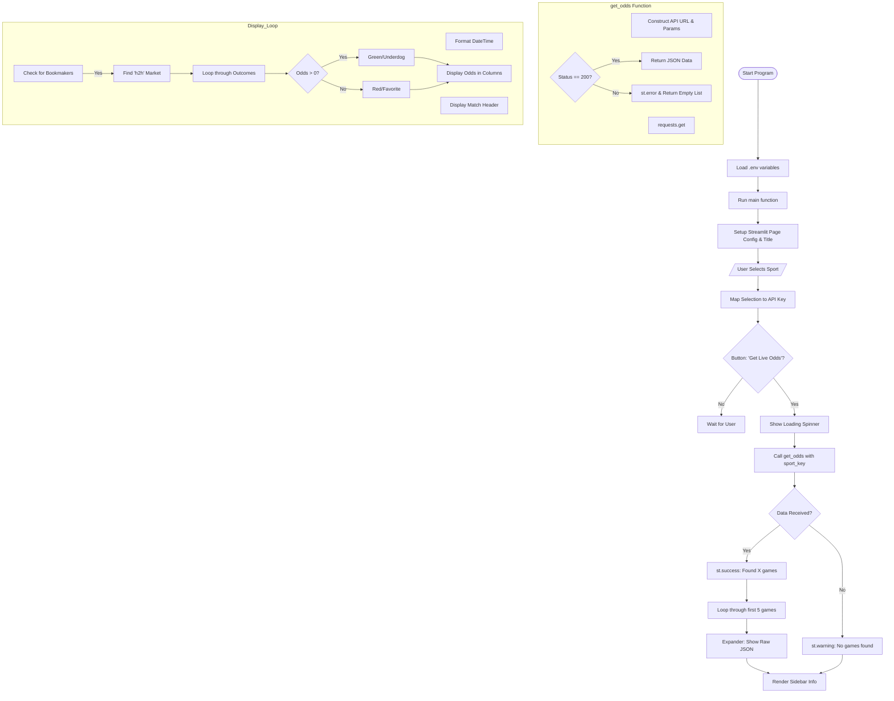

```mermaid
flowchart TD
    Start([Start Program]) --> EnvLoad[Load .env variables]
    EnvLoad --> Main[Run main function]
    Main --> UI_Config[Setup Streamlit Page Config & Title]
    UI_Config --> UserInput[/User Selects Sport/]
    UserInput --> MapKey[Map Selection to API Key]
    MapKey --> Button{Button: 'Get Live Odds'? }

    Button -- No --> WaitForInput[Wait for User]
    Button -- Yes --> Spinner[Show Loading Spinner]
    Spinner --> CallAPI[Call get_odds with sport_key]

    subgraph API_Call [get_odds Function]
        BuildURL[Construct API URL & Params]
        ReqGet[requests.get]
        CheckStatus{Status == 200?}
        CheckStatus -- Yes --> ReturnJSON[Return JSON Data]
        CheckStatus -- No --> ShowError[st.error & Return Empty List]
    end

    CallAPI --> CheckData{Data Received?}
    CheckData -- No --> WarnNoGames[st.warning: No games found]
    CheckData -- Yes --> SuccessMsg[st.success: Found X games]
    SuccessMsg --> LoopGames[Loop through first 5 games]
    
    subgraph Display_Loop
        FormatTime[Format DateTime]
        ShowHeader[Display Match Header]
        CheckBook[Check for Bookmakers]
        CheckBook -- Yes --> FindMarket[Find 'h2h' Market]
        FindMarket --> LoopOutcomes[Loop through Outcomes]
        LoopOutcomes --> ColorLogic{Odds > 0?}
        ColorLogic -- Yes --> Green[Green/Underdog]
        ColorLogic -- No --> Red[Red/Favorite]
        Green & Red --> ShowOdds[Display Odds in Columns]
    end

    LoopGames --> RawData[Expander: Show Raw JSON]
    RawData --> Sidebar[Render Sidebar Info]
    WarnNoGames --> Sidebar
```